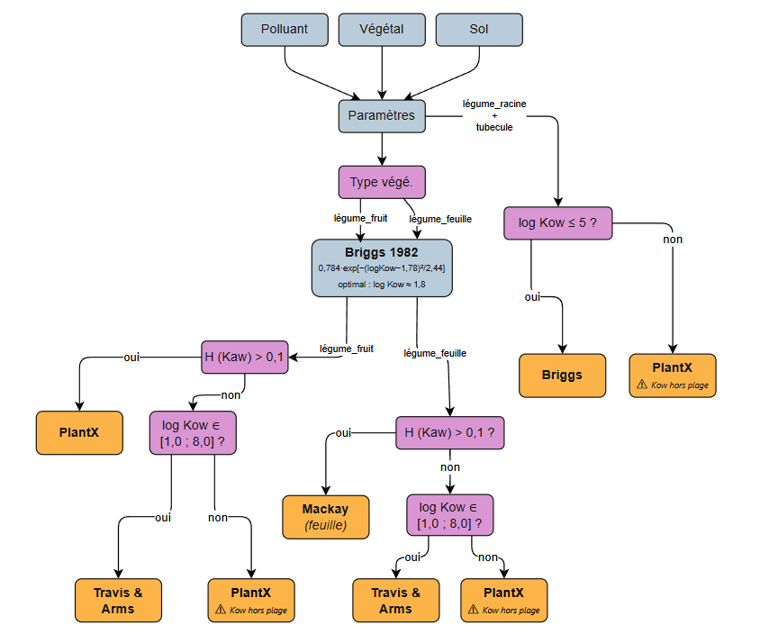

# Calculateur BCF sol-plante - MODUL'ERS

Calcule le facteur de bioconcentration sol-plante (Br_E) à renseigner dans l'outil MODUL'ERS (INERIS).  
Sortie : `mg/kg_vegsec / (mg/kg_sol)`, exportée dans un fichier Excel par site.

---

## Sommaire

1. [Principe général](#1-principe-général)
2. [Structure du projet](#2-structure-du-projet)
3. [Données d'entrée](#3-données-dentrée)
4. [Sélection du modèle (organiques)](#4-sélection-du-modèle-organiques)
5. [Modèles de calcul (organiques)](#5-modèles-de-calcul-organiques)
6. [Système d'avertissements (organiques)](#6-système-davertissements-organiques)
7. [Pipeline Métaux (BAPPET)](#7-pipeline-métaux-bappet)
8. [Pipeline PCB/PCDD-F (table officielle INERIS)](#8-pipeline-pcbpcddf-table-officielle-ineris)
9. [Utilisation](#9-utilisation)
10. [Format de sortie](#10-format-de-sortie)
11. [Ajouter un site](#11-ajouter-un-site)
12. [Références](#12-références)

---

## 1. Principe général

Le script produit le facteur de bioconcentration sol-plante pour **trois familles de polluants**, chacune avec sa propre méthodologie de calcul, puis **fusionne les résultats en une feuille Excel par catégorie végétale** (et non par pipeline) - chaque feuille liste tous les polluants applicables à cette catégorie, tous pipelines confondus :

| Pipeline | Polluants | Méthode |
|----------|-----------|---------|
| **Organiques** | HAP, BTEX, COHV, HCT (36 substances) | Modèles mécanistes/empiriques (Briggs, Travis & Arms, Mackay_97, PlantX) sélectionnés selon organe/H/log Kow |
| **Métaux** | 15 ETM (As, Cd, Co, Cr, Cu, Hg, Mn, Mo, Ni, Pb, Sb, Se, Tl, V, Zn) | 8 ETM : table officielle INERIS-DRC-17-163615 (régression/distribution déjà publiées) ; 7 ETM : régression statistique recalculée sur données terrain BAPPET, filtres qualité INERIS |
| **PCB/PCDD-F** | 34 substances (7 dioxines, 10 furannes, 17 PCB) | Table Br/Bf officiellement publiée par INERIS (projet TROPHé), lue directement - pas de régression recalculée |

Pour le pipeline **organiques**, pour chaque combinaison `(polluant × végétal)`, le script :

1. charge les paramètres physico-chimiques du polluant et les caractéristiques du végétal ;
2. sélectionne automatiquement le modèle le plus adapté selon l'organe cible et les propriétés du polluant ;
3. calcule le Br_E ;
4. génère des avertissements si le polluant sort du domaine de validité du modèle.

Le pipeline **Métaux** ne part pas de propriétés physico-chimiques mais recalcule un facteur de bioconcentration par régression statistique sur des données terrain BAPPET, rechargées et traitées à chaque exécution. Le pipeline **PCB/PCDD-F** lit directement une table de valeurs Br/Bf déjà publiées par INERIS (pas de recalcul). `main.py::build_sheets_par_vegetal()` fusionne ensuite les 3 résultats dans un schéma de colonnes commun et les répartit par catégorie végétale (voir [§10](#10-format-de-sortie)).

---

## 2. Structure du projet

```
CalculateurBCF/
│
├── main.py                  # Point d'entrée - 3 pipelines (organiques/métaux/PCB), export Excel multi-onglets
│
├── core/
│   ├── selector.py          # Choix du modèle organique selon organe, log Kow, H
│   ├── calculator.py        # Orchestration du calcul Br_E organiques
│   └── validator.py         # Warnings post-calcul (domaine de validité, BCF négatif…)
│
├── models/
│   ├── briggs.py            # Briggs et al. (1982) - racines
│   ├── mackay97.py          # Hung & Mackay (1997) - feuilles volatils
│   ├── travis_arms.py       # Travis & Arms (1988) - parties aériennes
│   └── plantx.py            # Trapp & Matthies (1995) - bilan de masse
│
└── data/
    ├── polluants.py         # Base de données polluants organiques (HAP, BTEX, COHV)
    ├── vegetaux.py          # Paramètres des 5 catégories végétales + 9 catégories PCB (VEGETAUX_PCB)
    ├── sol.py               # Chargement, estimation et validation des paramètres sol
    ├── metaux.py            # Pipeline BCF métaux - table officielle INERIS (8 ETM) + régression BAPPET (7 ETM)
    ├── metaux_ineris_lookup.py # Tableaux 1-9 INERIS-DRC-17-163615-01452A transcrits (8 ETM : As,Cd,Cr,Hg,Ni,Pb,Se,V)
    ├── pcb.py                # Pipeline BCF PCB/PCDD-F - table officielle INERIS (+ régression BAPPOP legacy)
    ├── pcb_ineris_lookup.py # Tableaux 1-9 INERIS-DRC-16-159776-09593A transcrits (Br/Bf, 34 substances)
    ├── bappet/bappet.csv     # Données terrain métaux (source du pipeline Métaux)
    ├── bappop/bappop.csv     # Données terrain PCB, projet TROPHé (source de compute_bcf_pcb_regression_bappop, legacy)
    ├── aprifel/aprifel_pct_ms.csv  # % matière sèche par espèce (conversion MF→MS, pipeline Métaux)
    └── sites/
        ├── site_default.json  # Site de référence (exemple complet)
        └── site_A.json        # Exemple site réel
```

---

## 3. Données d'entrée

### Polluants (`data/polluants.py`)

36 substances réparties en quatre familles. **8 substances** (4 HAP, 2 BTEX, 2 COHV) sont issues du Tableau 2 INERIS DRC-05-57281 (validées expérimentalement sur tomate, haricot, laitue, carotte) ; les **28 substances restantes** complètent la couverture HAP/BTEX/COHV/HCT depuis d'autres sources (IARC92, EPI Suite, EPA SSL, TPHCWG - voir le champ `source` dans `data/polluants.py`) et sont marquées « à valider » :

| Famille | Substances | Issues du Tableau 2 INERIS |
|---------|-----------|------------------------------|
| HAP (16) | naphtalène, acénaphtylène, acénaphtène, fluorène, phénanthrène, anthracène, fluoranthène, pyrène, benzo(a)anthracène, chrysène, benzo(b)fluoranthène, benzo(k)fluoranthène, benzo(a)pyrène, indéno(1,2,3-cd)pyrène, dibenzo(a,h)anthracène, benzo(g,h,i)pérylène | naphtalène, anthracène, phénanthrène, benzo(a)pyrène (4/16) |
| BTEX (5) | benzène, toluène, éthylbenzène, o-xylène, m,p-xylène | benzène, toluène (2/5) |
| COHV (13) | chloroforme, tétrachloroéthylène, trichloroéthylène, cis-1,2-dichloroéthylène, trans-1,2-dichloroéthylène, 1,1-dichloroéthylène, chlorure de vinyle, 1,1,2-trichloroéthane, 1,1,1-trichloroéthane, 1,2-dichloroéthane, 1,1-dichloroéthane, tétrachlorométhane, dichlorométhane | chloroforme, tétrachloroéthylène (2/13) |
| HCT (2) | fraction c10-c12, fraction c12-c16 | aucune (nouvelle famille, hors Tableau 2 INERIS - voir note ci-dessous) |

Chaque polluant est défini par : `log_kow`, `log_koc`, `MW` (g/mol), `Pvap` (Pa), `H` (constante de Henry adimensionnelle).

#### HCT - hydrocarbures totaux (fractions C10-C40)

Les hydrocarbures pétroliers sont mesurés en laboratoire (norme ISO 16703) sous forme de fractions par bande de carbone (`Fraction C10-C12`, `C12-C16`, `C16-C20`, ... jusqu'à `C36-C40`), pas comme une substance unique - un « HC Totaux » global n'a pas de sens physico-chimique pour un calcul par organe (log Kow/H « moyen » sur un agrégat de centaines de composés très hétérogènes).

**Seules 2 fractions sont modélisées : `fraction c10-c12` et `fraction c12-c16`.** Leurs paramètres physico-chimiques sont un mix pondéré 70 % aliphatique / 30 % aromatique (convention par défaut faute de spéciation labo, guide wallon des sols pollués), dérivés des tables TPHCWG (1997) via Washington State Dept. of Ecology (MTCA Table 747-4 / CLARC Table 4, rev. 2022) - voir le champ `source` de chaque entrée dans `data/polluants.py` pour le détail des calculs (ordre des opérations important : dérivation par composante aliphatique/aromatique puis mix, pas l'inverse).

**Les fractions plus lourdes (C16-C20 à C36-C40) sont volontairement exclues**, pas seulement par manque de données : leur log Kow extrapolé avoisine 10, très au-delà du domaine calibré des 4 modèles du pipeline (Briggs/Travis_Arms/Mackay_97/PlantX, calés empiriquement sur log Kow ≲ 8). Cette exclusion est cohérente avec le comportement physico-chimique connu des composés très hydrophobes : la formule TSCF déjà utilisée par le pipeline (`TSCF = 0.784 × exp(-(log Kow - 1.78)² / 2.44)`, Briggs 1982, voir §5 PlantX/Mackay_97) est une courbe en cloche qui décroît fortement au-delà de log Kow ≈ 3-4 - le transfert xylémique devient quasi nul pour ces composés, qui sont majoritairement retenus par la matière organique du sol plutôt que transférés vers la plante. Ce n'est donc pas qu'une limite de calcul, mais un phénomène physique réel qui justifie l'absence de modélisation.

> **Comportement si des clés `conc_air` supplémentaires sont ajoutées** (ex. un futur bulletin labo réel avec les 8 fractions, dont les 6 exclues) : `data/sol.py::validate_sol()` ne vérifie que les clés *manquantes* par rapport à `POLLUANTS` - une clé de `conc_air` sans correspondance dans `POLLUANTS` (ex. `"fraction c16-c20"`) est **silencieusement ignorée**, sans erreur ni avertissement. Elle n'est simplement jamais lue nulle part dans le pipeline.

### Végétaux (`data/vegetaux.py`)

5 catégories, chacune caractérisée par son organe cible et ses paramètres physiologiques :

| Catégorie | Organe | Exemples |
|-----------|--------|---------|
| légumes_fruits | fruit | tomate, haricot, courgette… |
| légumes_feuilles | feuille | laitue, épinard, chou… |
| légumes_racines | racine | carotte, betterave, navet… |
| tubercules | racine | pomme de terre |
| fruits | fruit | fraisier, pommier, vigne… |

Paramètres utilisés par les modèles : `lipide`, `densite`, `evapotranspiration`, `surface_feuille`.

### Sol (`data/sites/site_*.json`)

**Paramètres obligatoires :**

| Clé | Description | Exemple |
|-----|-------------|---------|
| `pH` | pH du sol | `8.0` |
| `matiere_organique` **ou** `carbone_organique_mgkg` | fraction massique de MO (ex: 0.17 = 17 %), **ou** COT labo en mg/kg — au moins l'un des deux (voir plus bas) | `0.17` ou `27000` |
| `conc_air` | concentration atmosphérique par polluant (µg/m³) | voir JSON |

> **Note - `conc_sol` absente intentionnellement**  
> Br_E est un facteur de transfert (ratio plante/sol) : pour les modèles racine (Briggs, PlantX) et les modèles parties aériennes sans voie atmosphérique (Travis & Arms), la concentration sol se simplifie algébriquement et n'influe pas sur le résultat.  
> Pour les organes aériens avec voie atmosphérique (PlantX feuille/fruit, Mackay_97), c'est `conc_air` qui introduit la dépendance au site - c'est le seul paramètre de concentration nécessaire.  
> `conc_sol` est à renseigner directement dans MODUL'ERS pour obtenir la concentration absolue dans le végétal (`C_plante = Br_E × conc_sol`).

**Paramètres optionnels** (estimés automatiquement si absents) :

| Clé | Description | Défaut si absent |
|-----|-------------|-----------------|
| `pct_argile` | % argile | `None` → Rawls (1983) |
| `pct_limon` | % limon | `None` → Rawls (1983) |
| `temperature` | °C | `17.5` (Météo-France) - non fourni dans les sites d'exemple, calculé par défaut |
| `carbone_organique_mgkg` | COT mesuré en labo (mg/kg) | `None` → estimation `MO / 1,724` (facteur de Van Bemmelen). Si fourni : remplace directement cette estimation ; et si `matiere_organique` est absente du JSON, la dérive aussi automatiquement (`MO = COT/1e6 × 1,724`) — les deux champs sont donc interchangeables, un seul suffit |

**Paramètres optionnels spécifiques au pipeline Métaux** :

| Clé | Description | Effet si renseigné |
|-----|-------------|---------------------|
| `conc_sol_metaux` | `{ETM: Cs mg/kg_MS}` | Br_E métaux calculé par régression BAPPET (`exp(A + B·ln(Cs))`) si Cs dans le domaine de validité et régression retenue ; sinon fallback moyenne géométrique pondérée (voir [§7](#7-pipeline-métaux-bappet)) |

> `conc_sol_pcb`/`conc_air_gaz_pcb` ont été retirés des JSON de site (champs réservés jamais consommés par `data/pcb.py` - le pipeline PCB/PCDD-F ne prend aucune entrée du site depuis le passage à la table officielle INERIS, voir [§8](#8-pipeline-pcbpcddf-table-officielle-ineris)).

**Paramètres calculés automatiquement par `load_sol()` :**

- `carbone_organique` = `carbone_organique_mgkg / 1e6` si fourni, sinon `MO / 1,724` (voir `carbone_organique_source` : `"mesure_labo"` ou `"estime_MO/1.724"`)
- `matiere_organique`, si absente du JSON, dérivée de `carbone_organique_mgkg × 1,724` (sinon erreur : l'un des deux champs est requis)
- `densite` - Manrique & Jones (1991) si argile+limon disponibles, sinon Rawls (1983)
- `fraction_eau` - Saxton & Rawls (2006) si argile disponible, sinon 0.30 (INERIS)
- `fraction_air` = porosité totale − fraction_eau

---

## 4. Sélection du modèle (organiques)

`core/selector.py` choisit automatiquement le modèle selon l'organe cible, la constante de Henry (H) et le log Kow :



```
organe = racine
    log Kow ≤ 5.0  →  Briggs
    log Kow > 5.0  →  PlantX       (HAP lourds, hors domaine Briggs)

organe = feuille
    H > 0.1                        →  Mackay_97    (voie atmosphérique dominante)
    H ≤ 0.1 et 1 ≤ log Kow ≤ 8    →  Travis_Arms
    sinon                          →  PlantX

organe = fruit
    H > 0.1                        →  PlantX
    H ≤ 0.1 et 1 ≤ log Kow ≤ 8    →  Travis_Arms
    sinon                          →  PlantX
```

---

## 5. Modèles de calcul (organiques)

### Briggs et al. (1982) - racines, log Kow ≤ 5.0

Régression empirique sur orge hydroponique :

```
log BCF = 0.77 × log Kow − 1.52
```

Domaine de calibration documenté : −0.57 ≤ log Kow ≤ 3.7. Un warning est émis hors de cette plage.  
Ne dépend que du log Kow - les paramètres végétaux ne sont pas utilisés.

**Traitement des limites de validité :**

| Limite | Comportement | Justification |
|--------|-------------|---------------|
| log Kow > 5.0 | Bascule sur PlantX (dans le sélecteur) | Briggs non fiable pour les HAP lourds |
| log Kow < −0.57 | Warning post-calcul uniquement, Briggs maintenu | Composés en dessous de cette limite rares en contexte sites pollués - un avertissement est jugé suffisant |

### Travis & Arms (1988) - parties aériennes

Régression empirique sur végétaux de champ :

    log BCF = 1.588 − 0.578 × log Kow

Domaine de validité : 1.0 ≤ log Kow ≤ 8.0.

**Conditions de sélection :**  
Retenu pour les feuilles et fruits quand H ≤ 0.1 (voie atmosphérique 
négligeable) et log Kow ∈ [1.0 ; 8.0]. Dans ces conditions, la régression 
empirique calibrée sur parties aériennes de végétaux de champ est jugée 
plus adaptée que PlantX, dont la validation expérimentale (INERIS 
DRC-05-57281) porte principalement sur les fruits (tomate, haricot).

**Limites documentées :**  
Prédit les valeurs centrales des observations sans caractère conservatoire 
(McKone & Maddalena, 2007). Non fiable au-delà de log Kow = 8.0.

### Hung & Mackay (1997) - feuilles, composés volatils (H > 0.1)

Modèle fugacité 3 compartiments. Calcule la concentration foliaire à partir de deux voies d'entrée :
- voie racinaire via le flux de transpiration (TSCF) ;
- voie atmosphérique via la conductance foliaire (gA).

Sensible à `conc_air` : utiliser une mesure représentative du site.

**Note sur la voie atmosphérique :**  
Le terme sol `TSCF × Ceau/Csol × Q` est en kg/j (ρb normalisé par Csol) ; le terme air `Cair × gA / H` est converti de mg/j en kg/j (facteur 1e-6) pour homogénéité. Pour des concentrations en air typiques (< 1 000 µg/m³), la voie atmosphérique reste négligeable devant la voie sol dans le calcul du Br_E.

### PlantX - Trapp & Matthies (1995) - bilan de masse

Modèle mécaniste à l'état pseudo-stationnaire. La chaîne de calcul est conditionnée à l'organe cible pour éviter les calculs inutiles :

**Toujours calculés :**
- TSCF (Transpiration Stream Concentration Factor), formule Briggs 1982 uniquement :  
  `TSCF = 0.784 × exp(−(log Kow − 1.78)² / 2.44)`  
  La formule Hsu 1991 (`0.70 × exp(−(log Kow − 3.07)² / 2.78)`) n'est pas retenue. Les deux formules divergent d'environ un ordre de grandeur pour 0 < log Kow < 5 (McKone & Maddalena, LBNL-60273, p.13) ; faute de consensus, l'approche `max(Briggs, Hsu)` n'est pas implémentée.
- BCF_racine via flux de transpiration et TSCF

**Uniquement si feuille ou fruit :**
- BCF_feuille = bilan flux xylème entrant + échange atmosphérique  
  (terme air converti de mg/j en kg/j par ×1e-6 pour homogénéité avec le terme sol)

**Uniquement si fruit :**
- BCF_fruit = bilan flux phloème (depuis feuille) + échange atmosphérique  
  (même conversion ×1e-6 sur le terme air)

---

## 6. Système d'avertissements (organiques)

`core/validator.py` ajoute des warnings post-calcul dans les cas suivants :

| Condition | Message |
|-----------|---------|
| PlantX + log Kow > 5.0 | Modèle non validé pour les HAP lourds |
| Mackay_97 + organe feuille | BCF sensible à `conc_air` - utiliser une mesure site |
| **PlantX** + organe fruit + exemples hors tomate/haricot | PlantX validé sur tomate/haricot uniquement |
| BCF ≤ 0 | Erreur - vérifier les paramètres d'entrée |

> Le warning fruit est restreint au modèle PlantX : Travis & Arms est une régression empirique générale sur parties aériennes qui ne dépend pas de la validation expérimentale tomate/haricot.

Chaque modèle produit également ses propres warnings de domaine de validité (`briggs_validity`, `travis_arms_validity`).

---

## 7. Pipeline Métaux (BAPPET + table officielle INERIS)

`data/metaux.py` calcule un Br_E pour 15 éléments traces métalliques (ETM). Contrairement au pipeline organiques, ce n'est **pas** un modèle physico-chimique : c'est une régression statistique, mais la source diffère selon le métal :

| ETM | Source |
|---|---|
| **As, Cd, Cr, Hg, Ni, Pb, Se, V** (8) | Table officielle publiée par INERIS-DRC-17-163615-01452A (`data/metaux_ineris_lookup.py`) - régression et/ou distribution déjà calculées par INERIS, pas recalculées |
| **Co, Cu, Mn, Mo, Sb, Tl, Zn** (7) | Régression recalculée à chaque exécution sur `data/bappet/bappet.csv` (sections ci-dessous) |

Le rapport INERIS-DRC-17-163615-01452A (26/06/2017, "Coefficients de transfert des éléments traces métalliques vers les plantes, utilisés pour l'évaluation de l'exposition - Application dans le logiciel MODUL'ERS") publie pour ces 8 ETM, par catégorie végétale, une distribution statistique ajustée (min/max/médiane) et, quand les données le permettent, une régression `ln BCF = intercept + B·ln(Cs) [+ C·pH] [+ D·MO]` avec son domaine de validité. `data/metaux_ineris_lookup.py` transcrit ces valeurs ; `data/metaux.py::_build_ineris_metaux_rows()` les utilise directement, sans repasser par les filtres F1-F10 ni par BAPPET pour ces 8 ETM.

**Calcul du Br_E pour ces 8 ETM :**
1. Si la régression officielle existe et que toutes les variables qu'elle utilise sont disponibles et dans leur domaine de validité publié → `Br_E = exp(intercept + B·ln(Cs) [+ C·pH] [+ D·MO])`, source `ineris_regression`. Notable différence avec les 7 ETM BAPPET : `pH` et `matière organique` sont des paramètres sol *obligatoires*, donc une régression n'utilisant que ces deux variables (ex. chrome/légumes-feuilles : `ln BCF = -5,3 + 0,25·MO`) est évaluable **même sans `conc_sol_metaux` renseigné** - seules les régressions utilisant `ln(Cs)` exigent que ce champ soit fourni pour ce métal.
2. Sinon → la médiane publiée (source `ineris_mediane`), ou le milieu de l'intervalle `[min ; max]` si aucune médiane n'est fournie (source `ineris_intervalle_moyen`).
3. Certaines catégories n'ont pas de données propres et reprennent intégralement celles d'une autre catégorie (ex. tubercules → légumes-racines pour le vanadium) - substitution explicite documentée dans `data/metaux_ineris_lookup.py`.

Ce rapport ne couvre que 8 des 15 ETM - les 7 autres restent entièrement calculés par le pipeline BAPPET décrit ci-dessous.

### Filtres qualité INERIS (F1–F10) — pipeline BAPPET (7 ETM non couverts)

Appliqués séquentiellement sur les données BAPPET avant régression :

| Filtre | Critère | Assouplissement (n ≤ 10) |
|--------|---------|---------------------------|
| F1 | Mode de culture - pleine terre uniquement (exclusion pot/intérieur/container) | - |
| F2 | Contexte - exclusion urbain + industriel | relâché |
| F3 | Origine de la pollution - exclusion artificielle + urbaine | relâché |
| F4 | Extraction sol - totale/pseudo-totale (exception : As → partielle conservée) | - |
| F5 | Organe analysé - partie consommée du végétal uniquement | - |
| F6 | LOQ - exclusion des valeurs < LQ/< LD (sol et plante) | - |
| F7 | Préparation - lavage requis ; « non précisé » exclu en mode strict | relâché |
| F8 | Appariement sol-plante - Cp et Cs numériques (implicite via BCF calculable) | - |
| F9 | Bruit de fond RECORD 1994 - exclusion si `Cs < 5×BDF` et `BCF > 10×BCF_médian_groupe` | - |
| F10 | Grubbs α = 5 % - retrait itératif des outliers sur `ln(BCF)` | - |

Par groupe `(ETM × catégorie INERIS)`, si le nombre de données valides après filtres stricts est **≤ 10**, F2/F3/F7 sont relâchés pour ce groupe (mode `assoupli` vs `strict`, tracé dans la colonne `mode_filtrage`).

Les 6 catégories INERIS (mapping depuis `Type Plante` de BAPPET) : `légumes-feuilles`, `légumes-fruits`, `légumes-racines`, `tubercules`, `céréales`, `fourrage`.

Le pourcentage de matière sèche (conversion MF→MS de la concentration plante) est lu depuis BAPPET si disponible, sinon recherché dans `data/aprifel/aprifel_pct_ms.csv` par correspondance exacte/approchée du nom d'espèce, avec fallback sur une valeur par défaut par type de plante.

### Régressions et distribution (7 ETM BAPPET)

- **Régression simple OLS** : `ln(BCF) = A + B·ln(Cs)`, calculée si n ≥ 3 points et Cs variable.
- **Régression multiple OLS** : ajout de `pH` et/ou `matière organique` si n ≥ 9 et présélection Pearson (α = 10 %) + amélioration du R² ajusté.
- **Distribution ajustée (Anderson-Darling)** : la loi log-normale est retenue si le test AD de log-normalité a un p ≥ 5 % ; sinon la meilleure alternative parmi {normale, Pearson V, gamma, uniforme} (plus petite statistique AD).
- **Régression retenue** (`regression_retenue`) : la régression simple est jugée plus informative que la distribution si son ratio observé/prédit (`OP_max/OP_min`) est inférieur au plus petit des ratios `BCF_max/BCF_min` et du ratio interpercentile [2,5 % ; 97,5 %] de la distribution.

### Calcul du Br_E final (7 ETM BAPPET)

Pour chaque groupe `(ETM × catégorie)`, le Br_E dépend de la présence de `conc_sol_metaux` dans le site JSON (`Br_E_source`) :

| Cas | Br_E | Source |
|-----|------|--------|
| Régression retenue, Cs fourni et dans le domaine de validité `[Cs_valid_min ; Cs_valid_max]` | `exp(A_simple + B_simple·ln(Cs))` | `regression` |
| Régression retenue, Cs fourni mais hors domaine | `BCF_mean_geom_pond` | `moy_geom_hors_domaine` |
| `conc_sol_metaux` absent du site JSON | `BCF_mean_geom_pond` | `moy_geom_cs_absent` |
| Régression non retenue (non significative ou n insuffisant) | `BCF_mean_geom_pond` | `moy_geom_reg_non_retenue` |

`BCF_mean_geom_pond` est la moyenne géométrique du BCF pondérée par le nombre d'échantillons par observation (`Nb échantillons` BAPPET).

---

## 8. Pipeline PCB/PCDD/F (table officielle INERIS)

`data/pcb.py::compute_bcf_pcb()` (= `compute_bcf_pcb_ineris()`) lit directement les **Tableaux 1 à 9** du rapport INERIS-DRC-16-159776-09593A (26/06/2017, "Application dans le logiciel MODUL'ERS"), transcrits dans `data/pcb_ineris_lookup.py`. Ce sont des valeurs **déjà calculées et publiées par INERIS** à partir du projet TROPHé - pas une régression recalculée à partir de zéro.

### Couverture

**34 substances** : 7 dioxines, 10 furannes, 17 PCB (dont les 7 indicateurs déjà suivis auparavant). Par catégorie végétale, deux facteurs quand disponibles :

- **Br** (sol → plante, kg sec.kg⁻¹) - Tableaux 1-6 : tubercules, légumes-racines, légumes-feuilles, légumes-fruits et fruits (hors Cucurbita), Cucurbita (accumulation nettement supérieure, catégorie distincte), fourrage. **Céréales** : Br = 0 pour tous les congénères par convention (grain protégé par une enveloppe, transfert jugé nul). **Ensilage** : identique au fourrage (herbe) ou fourrage ÷ 2 sur min/ponctuelle (maïs, grain non contaminé ≈ 50 % de la MS).
- **Bf** (air gazeux → plante, m³.kg frais⁻¹) - Tableaux 7-9 : fourrage, légumes-feuilles, légumes-fruits et fruits. **Tubercules** et **céréales** : Bf = 0 (ordonnée à l'origine nulle/grain protégé). **Légumes-racines** et **Cucurbita** : Bf non déterminé par le rapport (données insuffisantes ou apport air jugé négligeable, à ne pas confondre avec une valeur nulle).

Chaque groupe `(substance × catégorie)` a un intervalle `[min ; max]` et, si déterminable, une valeur ponctuelle. `main.py::_rows_pcb()` retient la valeur ponctuelle en priorité, sinon le milieu de l'intervalle, sinon l'unique borne connue - et ignore les groupes sans aucune valeur Br publiée.

### Pipeline legacy (régression BAPPOP, conservé pour validation)

`data/pcb.py::compute_bcf_pcb_regression_bappop()` conserve l'ancienne approche : régression OLS `Cp_MS = f(Cs)` recalculée sur les données brutes `data/bappop/bappop.csv` (même projet TROPHé), avec retrait d'outliers par test de Grubbs (α = 5 %), pour les 7 congénères PCB indicateurs uniquement. Cette fonction n'est plus appelée par `main.py` mais reste disponible pour comparer la régression indépendante aux valeurs officielles INERIS sur les congénères communs - un chapitre de validation naturel, les deux approches partant des mêmes données terrain.

> Les champs `conc_sol_pcb` et `conc_air_gaz_pcb` du JSON site restent réservés pour une évolution future (combiner Br/Bf avec une concentration sol/air mesurée sur site, à la manière du pipeline Métaux) - non consommés à ce jour.

---

## 9. Utilisation

### Prérequis

```
pip install pandas openpyxl scipy numpy
```

### Lancer le calcul

```bash
# Site par défaut (data/sites/site_default.json) - calcule les 3 pipelines
python main.py

# Site spécifique (data/sites/site_A.json)
python main.py --site A

# Désactiver un pipeline (ex : si les CSV BAPPET/BAPPOP ne sont pas disponibles)
python main.py --no-metaux
python main.py --no-pcb
```

| Option | Effet |
|--------|-------|
| `--site <nom>` | Charge `data/sites/site_<nom>.json` (défaut : `default`) |
| `--no-metaux` | Ignore le calcul BCF métaux (BAPPET) - famille `Métal` absente des feuilles générées |
| `--no-pcb` | Ignore le calcul BCF PCB/PCDD-F (table officielle INERIS) - familles `Dioxine`/`Furanne`/`PCB` absentes des feuilles générées |

### Résultat console (exemple)

```
----------Chargement paramètres sol : site_default.json
  [info] temperature non fourni -> valeur par défaut : 17.5

---------- Sol chargé : site_default
   pH               = 8.0
   MO               = 17.0 %
   Corg             = 0.0986  (estime_MO/1.724)
   Densité estimée  = 0.81 kg/dm³
   Fraction eau     = 0.305
   Fraction air     = 0.389
   Température      = 17.5 °C

----------Calcul BCF polluants organiques...

----------Calcul BCF métaux (BAPPET)...
...
----------Calcul BCF PCB/PCDD-F (table officielle INERIS)...

----------Export : Br_E_default.xlsx  (4 onglet(s))
  légumes_feuilles (84 lignes)
  légumes_fruits (84 lignes)
  légumes_racines (83 lignes)
  tubercules (84 lignes)
```

---

## 10. Format de sortie

Fichier Excel `Br_E_<site>.xlsx` avec **une feuille par catégorie végétale**, construite par `main.py::build_sheets_par_vegetal()` qui fusionne les 3 pipelines (organiques/métaux/PCB) dans un schéma de colonnes commun. Seules les catégories listées dans `CATEGORIE_ORDER` génèrent une feuille, et seulement si elles ont au moins une ligne de résultat.

**Catégories** (ordre d'affichage, `CATEGORIE_ORDER` dans `main.py`) : `légumes_feuilles`, `légumes_fruits`, `légumes_racines`, `tubercules` - les 4 catégories de la taxonomie `data/vegetaux.py` (pipeline organiques). Les catégories `fruits` (organiques, arbres fruitiers), `céréales` et `fourrage` (Métaux/PCB), ainsi que `cucurbita`/`ensilage_herbe`/`ensilage_mais` (PCB uniquement) existent dans les pipelines sources mais ne génèrent volontairement pas de feuille dédiée - choix délibéré pour garder un nombre de feuilles restreint aux catégories maraîchères courantes. Les catégories Métaux (`légumes-feuilles`, tirets) et PCB (`legumes_feuilles`, sans accents) sont ramenées à cette taxonomie unique via `_MET_CAT_MAP`/`_PCB_CAT_MAP` dans `main.py`.

Chaque feuille contient une ligne par polluant applicable à la catégorie, toutes familles mélangées (HAP/BTEX/COHV/Métal/PCB), avec les colonnes communes suivantes :

| Colonne | Description |
|---------|-------------|
| `polluant` | Nom du polluant (organique), ETM (métal) ou congénère PCB |
| `famille` | HAP / BTEX / COHV / Métal / PCB |
| `categorie` | Catégorie végétale (= nom de la feuille) |
| `Br_E` | Facteur de bioconcentration retenu - voir la logique par famille ci-dessous |
| `unité` | mg/kg_vegsec / (mg/kg_sol) |
| `methode` | Modèle/méthode utilisé (voir détail par famille) |
| `note` | Avertissements ou détails de qualité de la régression (voir détail par famille) |

**Logique de `Br_E`/`methode`/`note` selon la famille :**

- **Organiques (HAP/BTEX/COHV)** : `Br_E` = sortie directe du modèle sélectionné (§4-5) ; `methode` = nom du modèle (Briggs/Travis_Arms/Mackay_97/PlantX) ; `note` = warnings de `core/validator.py` concaténés (ex : domaine de validité, PlantX hors HAP lourds).
- **Métal** : `Br_E` = valeur finale calculée par `data/metaux.py` (régression Cs-dépendante ou moyenne géométrique pondérée selon `Br_E_source`, voir [§7](#7-pipeline-métaux-bappet)) ; `methode` = `"<modele> (<Br_E_source>)"` ; `note` = taille d'échantillon, mode de filtrage (`strict`/`assoupli`) et r² de la régression simple si disponible.
- **Dioxine / Furanne / PCB** : `Br_E` = valeur ponctuelle publiée par INERIS (Tableaux 1-6, voir [§8](#8-pipeline-pcbpcddf-table-officielle-ineris)) si disponible, sinon le milieu de l'intervalle `[Br_min ; Br_max]`, sinon l'unique borne connue ; `methode` précise laquelle des trois voies a été utilisée ; `note` = intervalle Br complet et, si publié, le Bf (air gazeux→plante) correspondant.

Les colonnes détaillées propres à chaque pipeline (statistiques de régression complètes pour les métaux, `Bf_min`/`Bf_max`/`pcb_numero` pour les PCB/PCDD-F, `nb_cycles`/`organe` pour les organiques…) ne sont **pas** reportées dans ce format condensé - elles restent disponibles en appelant directement `compute_bcf_metaux()` / `compute_bcf_pcb()` / `compute_bre()` en Python si une analyse plus fine est nécessaire.

---

## 11. Ajouter un site

Créer `data/sites/site_<nom>.json` en copiant `site_default.json` et en renseignant :

1. `pH` propre au site, et `matiere_organique` **ou** `carbone_organique_mgkg` (un seul des deux suffit - voir [§3](#3-données-dentrée)) ;
2. optionnellement `pct_argile`, `pct_limon`, `temperature` pour affiner les estimations pédologiques ;
3. `conc_air` pour chacun des 36 polluants organiques (utiliser le seuil de quantification si non mesuré) ;
4. optionnellement `conc_sol_metaux` pour affiner le `Br_E` métaux par régression site-dépendante (sinon moyenne géométrique utilisée par défaut).

Puis lancer :

```bash
python main.py --site <nom>
```

---

## 12. Références

- **Briggs et al. (1982)** - Pestic Sci 13:495–504  
  Modèle sol-racine (orge hydroponique) ; formule TSCF retenue dans PlantX et Mackay_97.

- **Travis & Arms (1988)** - Environ Sci Technol 22:271–274  
  Régression empirique parties aériennes ; domaine de calibration source 1 < log Kow < 9, borne opérationnelle retenue à 8.0.

- **Hung & Mackay (1997)** - Chemosphere 35:959–977  
  Modèle fugacité 3 compartiments ; appliqué aux feuilles pour les composés volatils (H > 0.1).

- **Trapp & Matthies (1995)** - Environ Sci Technol 29:2333–2338  
  Modèle PlantX bilan de masse pseudo-stationnaire ; racines, feuilles et fruits.

- **McKone & Maddalena (2007)** - LBNL-60273  
  Comparaison des modèles TSCF (Briggs, Hsu, Trapp) et domaines de validité de Travis & Arms ; justification des bornes opérationnelles retenues.

- **INERIS DRC-05-57281 (2005)**  
  Modèles de transfert sol-plante des polluants organiques ; validation expérimentale et choix des modèles par organe cible.

- **INERIS-DRC-16-159776-09593A** (26/06/2017)  
  "Paramètres de transfert des polychlorodibenzodioxines, polychlorodibenzofurannes et des polychlorobiphényles, utilisés pour l'évaluation de l'exposition - Application dans le logiciel MODUL'ERS". Tableaux 1-9 (Br/Bf par catégorie végétale, projet TROPHé) transcrits dans `data/pcb_ineris_lookup.py` et utilisés directement par `data/pcb.py::compute_bcf_pcb()`. Méthodologie de régression BAPPOP historique conservée dans `compute_bcf_pcb_regression_bappop()`.

- **INERIS-DRC-17-163615-01452A** (26/06/2017)  
  "Coefficients de transfert des éléments traces métalliques vers les plantes, utilisés pour l'évaluation de l'exposition - Application dans le logiciel MODUL'ERS". Tableaux 1-9 (régressions/distributions par ETM × catégorie végétale, 8 ETM : As, Cd, Cr, Hg, Ni, Pb, Se, V) transcrits dans `data/metaux_ineris_lookup.py` et utilisés directement par `data/metaux.py::_build_ineris_metaux_rows()`. Les 7 ETM non couverts par ce rapport (Co, Cu, Mn, Mo, Sb, Tl, Zn) restent calculés par la régression BAPPET.

- **RECORD 1994**  
  Fond géochimique naturel français en éléments traces métalliques ; valeurs utilisées pour le filtre F9 (bruit de fond) dans `data/metaux.py` - à vérifier contre le document source (signalé comme tel dans le code).

- **APRIFEL**  
  Base de données % matière sèche par espèce végétale ; utilisée pour la conversion matière fraîche → matière sèche dans le pipeline Métaux (`data/aprifel/aprifel_pct_ms.csv`).
